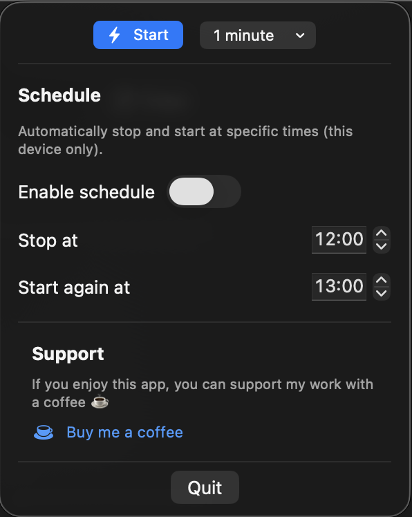

# MJApp — Mouse Jiggler & Mouse Mover for macOS

MJApp is a lightweight **mouse jiggler for macOS**.  
It subtly moves the mouse to keep your Mac active and prevent idle or away status.

This app is useful for:
- Remote work
- Preventing idle status in productivity tools
- Keeping your Mac active without heavy background apps

## Features
- Software-based mouse jiggler (no hardware needed)
- Lightweight and unobtrusive
- Optional scheduling (start and stop at specific times)
- No accounts
- No tracking
- Free to use

## Download

👉 **Download MJApp from the official website:**  
https://twitched.nl/mjapp.html

> MJApp is distributed outside the Mac App Store.

## What is a mouse jiggler?

A mouse jiggler is a tool that simulates small mouse movements to keep a computer active.
MJApp is a software-based mouse mover designed specifically for macOS.

## Disclaimer

This software may violate company IT or security policies.  
Use at your own risk.

---

© Twitched Studio
